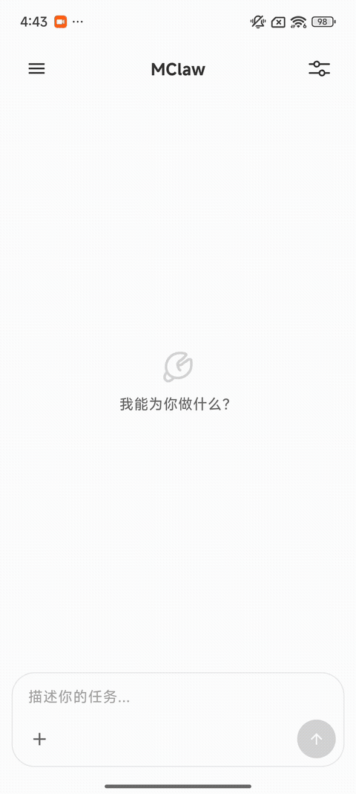
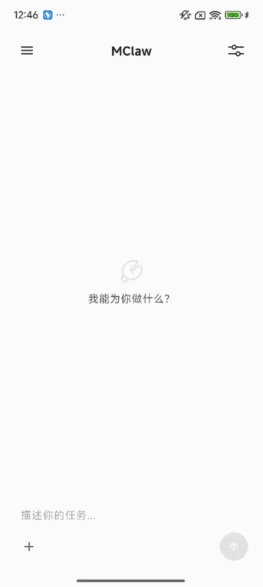

# ZenMux × MClaw

### 移动端原生 AI Agent 协作平台

手机即主机，随走随用。  
从简单对话到复杂协作，让 AI 在终端设备上真正拥有“手脚”。

<h2>无限想象，无限可能</h2>

  
  
  
  

---

## 一句话

**MClaw 让 ZenMux 从 AI 对话工具升级为移动端 AI Agent 平台：模型负责思考，工具负责行动，用户负责确认关键选择。**

MClaw 是 ZenMux 上的移动端原生 AI Agent 协作能力。它把云端大模型、本地工具、移动端系统能力、技能商店和人机确认串成一个可执行的Claw平台，让用户可以**发挥无限想象力，激发无限可能**。

## 为什么值得关注

<table>
  <tr>
    <td width="50%">
      <h3> 数据在手，隐私无忧</h3>
      
Agent 直接运行在移动端，文件、图片、录音、通知等上下文优先在端侧流转，贴近用户设备，也更尊重个人数据边界。

    </td>
    <td width="50%">
      <h3> 端侧沙箱，可信执行</h3>
      
通过 MClaw 可信执行引擎与端侧沙箱隔离工具运行环境，约束权限边界；涉及敏感动作时可结合 HITL 主动确认。

    </td>
  </tr>
  <tr>
    <td width="50%">
      <h3> 多路大脑，自由切换</h3>
      
结合 ZenMux 模型网关，领先 AI 模型可无缝接入，让不同任务匹配更合适的模型。

    </td>
    <td width="50%">
      <h3> 本地工具，灵活行动</h3>
      
通过移动端系统工具、文件工具、联网搜索、Memory、Python、Node、Shell 等能力完成真实操作。

    </td>
  </tr>
</table>

## 核心能力

| 能力 | 说明 |
| --- | --- |
| **适配手机的轻量化 Agentic Loop** | 面向移动端优化 `LLM → 工具调用 → 响应` 的执行链路，让复杂任务可以连续推进。 |
| **多 LLM Provider** | 结合 ZenMux 模型网关，Anthropic、OpenAI、OpenAI Compatible、Gemini 等领先 AI 模型可无缝集成。 |
| **移动端系统工具** | 适配日历、联系人、定位、通知、电话、短信、闹钟、剪贴板、拍照、录音等移动端特色能力。 |
| **轻量级 PC 执行环境** | 在手机上提供轻量执行环境，让海量 PC Skill 可以更自然地接入移动端 Agent 工作流。 |
| **Workspace 记忆** | 支持 `SOUL.md`、`IDENTITY.md`、`MEMORY.md` 等长期记忆与跨会话上下文，让 Agent 更懂你。 |
| **安全隐私** | 依托原生安全引擎处理敏感操作，让移动端隐私数据尽在“掌”中。 |

## 演示

<table>
  <tr>
    <td align="center" width="33%">
      
       
      <strong>飞猪技能预定酒店</strong>
       
      理解需求、询问偏好，并推进到可执行流程。
    </td>
    <td align="center" width="33%">
      
       
      <strong>系统拍照</strong>
       
      调用移动端拍照能力，把真实世界输入纳入工作流。
    </td>
    <td align="center" width="33%">
      
       
      <strong>系统录音</strong>
       
      调用录音能力，为会议纪要和音频分析打基础。
    </td>
  </tr>
</table>

## 加入测试

MClaw 能力目前仅在 **Android** 中可体验，请使用 **ZenMux Android 1.0.7 及以上版本**。

<table>
  <tr>
    <td width="50%">
      <h3> Android 体验版</h3>
      
下载 Android 1.0.7 以上版本，体验 MClaw 能力。

      
<a href="https://github.com/ZenMux/zenmux-app-feedback/releases/latest"><strong>releases/latest</strong></a>

    </td>
    <td width="50%">
      <h3> 提交问题</h3>
      
体验过程中遇到问题或有建议，欢迎在 GitHub Issues 中反馈。

      
<a href="https://github.com/ZenMux/zenmux-app-feedback/issues"><strong>提交 Issue</strong></a>

    </td>
  </tr>
</table>

### 快速开始

1. 下载并安装 ZenMux Android 1.0.7 及以上版本。
2. 打开 ZenMux，进入 MClaw / Agent 相关入口。
3. 尝试上传图片、处理文件、调用拍照或录音等移动端能力。
4. 如遇问题，请在 [ZenMux Feedback Issues](https://github.com/ZenMux/zenmux-app-feedback/issues) 提交反馈。

## 里程碑与后续计划

| 状态 | 事项 | 说明 |
| --- | --- | --- |
|  | Android MClaw 能力开放体验 | Android 1.0.7 及以上版本已可体验 MClaw Agent 能力。 |
|  | iOS 集成 | 后续将推进 iOS 侧 MClaw 能力接入，让更多移动端用户可以体验原生 Agent 工作流。 |
|  | 更多系统工具与技能 | 持续扩展移动端系统能力、ClawHub 技能和真实业务场景。 |
|  | 开源计划 | 后续将逐步整理 SDK、技能示例、工具桥接等内容，方便开发者共建移动端 Agent 生态。 |

## 欢迎体验

MClaw 还在快速进化，我们也很想看到你会把它用在哪些场景里：

- 让 Agent 帮你处理一组图片、整理一份文件、生成一段会议纪要。
- 试试把订酒店、查资料、发通知、做提醒串成一个连续任务。
- 如果你有自己的移动端 Agent 场景，欢迎在 Issue 里告诉我们。

**快来体验 ZenMux × MClaw，Show 出你的场景。**
