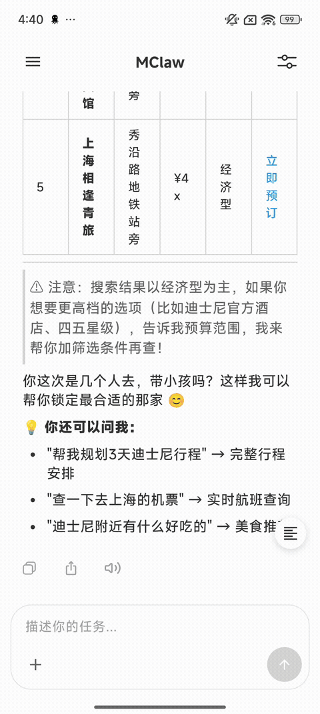

# ZenMux x MClaw

### Mobile-native AI Agent Collaboration Platform

Your phone becomes the host, ready wherever you go.  
From simple conversations to complex collaboration, MClaw gives AI real "hands and feet" on terminal devices.

<h2>Unlimited Imagination, Unlimited Possibilities</h2>

  
  
  
  

**English** | [简体中文](./README.zh-CN.md)

---

## In One Sentence

**MClaw upgrades ZenMux from an AI chat tool into a mobile AI Agent platform: the model thinks, tools act, and users confirm key decisions.**

MClaw is ZenMux's mobile-native AI Agent collaboration capability. It connects cloud LLMs, local tools, mobile system capabilities, the skill marketplace, and human-in-the-loop confirmation into an executable Claw platform, helping users **unleash unlimited imagination and unlock unlimited possibilities**.

## Why It Matters

<table>
  <tr>
    <td width="50%">
      <h3> Data in Hand, Privacy in Mind</h3>
      
Agents run directly on mobile devices. Files, images, recordings, notifications, and other context flow on-device first, staying close to the user and respecting personal data boundaries.

    </td>
    <td width="50%">
      <h3> On-device Sandbox, Trusted Execution</h3>
      
The MClaw trusted execution engine and on-device sandbox isolate tool runtime environments and constrain permission boundaries. Sensitive actions can be paired with HITL confirmation.

    </td>
  </tr>
  <tr>
    <td width="50%">
      <h3> Multiple Brains, Easy Switching</h3>
      
With the ZenMux model gateway, leading AI models can be integrated seamlessly so each task can use the model that fits it best.

    </td>
    <td width="50%">
      <h3> Local Tools, Flexible Action</h3>
      
MClaw can complete real actions through mobile system tools, file tools, web search, Memory, Python, Node, Shell, and more.

    </td>
  </tr>
</table>

## Core Capabilities

| Capability | Description |
| --- | --- |
| **Lightweight agentic loop for phones** | A mobile-optimized `LLM -> tool call -> response` execution chain that lets complex tasks keep moving forward. |
| **Multiple LLM providers** | Through the ZenMux model gateway, Anthropic, OpenAI, OpenAI Compatible, Gemini, and other leading AI models can be integrated seamlessly. |
| **Mobile system tools** | Adapts mobile-native capabilities such as calendar, contacts, location, notifications, phone calls, SMS, alarms, clipboard, camera, and recording. |
| **Lightweight PC execution environment** | Provides a lightweight execution environment on the phone, allowing a large number of PC skills to connect more naturally to mobile Agent workflows. |
| **Workspace memory** | Supports long-term memory and cross-session context such as `SOUL.md`, `IDENTITY.md`, and `MEMORY.md`, helping the Agent understand you better. |
| **Security and privacy** | Uses a native security engine for sensitive operations, keeping mobile privacy data truly in the palm of your hand. |

## Demos

<table>
  <tr>
    <td align="center" width="33%">
      
       
      <strong>Hotel Booking with Fliggy Skill</strong>
       
      Understands requirements, asks about preferences, and moves the task toward an executable flow.
    </td>
    <td align="center" width="33%">
      
       
      <strong>System Camera</strong>
       
      Calls mobile camera capabilities and brings real-world input into the workflow.
    </td>
    <td align="center" width="33%">
      
       
      <strong>System Recording</strong>
       
      Calls recording capabilities to support meeting notes and audio analysis.
    </td>
  </tr>
</table>

## Join the Test

MClaw is currently available for testing on **Android** only. Please use **ZenMux Android 1.0.7 or later**.

<table>
  <tr>
    <td width="50%">
      <h3> Android Preview</h3>
      
Download Android 1.0.7 or later to experience MClaw.

      
<a href="https://github.com/ZenMux/zenmux-app-feedback/releases/latest"><strong>releases/latest</strong></a>

    </td>
    <td width="50%">
      <h3> Submit Feedback</h3>
      
If you run into issues or have suggestions while testing, please share them in GitHub Issues.

      
<a href="https://github.com/ZenMux/zenmux-app-feedback/issues"><strong>Submit an Issue</strong></a>

    </td>
  </tr>
</table>

### Quick Start

1. Download and install ZenMux Android 1.0.7 or later.
2. Open ZenMux and enter the MClaw / Agent entry point.
3. Try uploading images, processing files, using the camera, recording audio, or calling other mobile capabilities.
4. If you encounter any issues, submit feedback in [ZenMux Feedback Issues](https://github.com/ZenMux/zenmux-app-feedback/issues).

## Milestones and Roadmap

| Status | Item | Description |
| --- | --- | --- |
|  | Android MClaw preview | ZenMux Android 1.0.7 and later already support the MClaw Agent experience. |
|  | iOS integration | iOS-side MClaw integration will be added later so more mobile users can experience native Agent workflows. |
|  | More system tools and skills | We will continue expanding mobile system capabilities, ClawHub skills, and real business scenarios. |
|  | Open-source plan | SDKs, skill examples, tool bridges, and related materials will be organized over time so developers can help build the mobile Agent ecosystem. |

## Welcome to Try It

MClaw is evolving quickly, and we would love to see what you build with it:

- Let the Agent process a batch of images, organize a file, or generate meeting notes.
- Try chaining hotel booking, research, notifications, and reminders into one continuous task.
- If you have your own mobile Agent scenario, share it with us in Issues.

**Try ZenMux x MClaw and show us your scenario.**
